<p align="center">
  
</p>

<h1 align="center">🌊 TSUNAMI</h1>

<p align="center">
  <strong>Oceanic Memory Runtime for AI Agents</strong>
</p>

<p align="center">
  Bun-native • Storm-centered context engine • Hot + cold retrieval • Knowledge graph sync
</p>

<p align="center">
  
  
  
  
  
</p>

<p align="center">
  <a href="README.zh-CN.md">中文文档</a>
</p>

---

<div align="center">

## Why TSUNAMI?

</div>

Most AI memory systems are **flat**, **stateless**, and **context-fragile**.

TSUNAMI treats memory as **flowing currents** — not static text, but **momentum**. Each memory carries energy, creates pressure, links to evidence, and feeds into a live storm center that models the agent's cognitive state in real time.

> Instead of storing text, TSUNAMI models **momentum**.

---

<div align="center">

## 🌊 Architecture

```mermaid
graph TD
    TSUNAMI["🌊 TSUNAMI Runtime"]

    TSUNAMI --> Basin["Basin<br/>Topic Areas"]
    TSUNAMI --> Storm["🌀 Storm Center<br/>Context Engine"]
    TSUNAMI --> Hot["⚡ Hot Retrieval<br/>SQLite FTS5"]
    TSUNAMI --> Cold["❄️ Cold Retrieval<br/>Semantic Graph"]
    TSUNAMI --> Graph["🧠 Knowledge Graph<br/>Triple Store"]

    Basin --> Project["project"]
    Basin --> Feedback["feedback"]
    Basin --> Reference["reference"]
    Basin --> User["user"]

    Storm --> Signals["Signal Energy"]
    Storm --> Pressure["Pressure Score"]
    Storm --> Gate["Execution Gate"]
    Storm --> Budget["Budget Control"]

    Hot --> FTS5["Sub-ms Full-text"]
    Cold --> Traversal["Graph Traversal"]

    Graph --> Sync["Cross-session Sync"]
    Graph --> Conflict["Conflict Detection"]
    Graph --> Evidence["Evidence Linking"]

    style TSUNAMI fill:#0d3b66,stroke:#1a73e8,color:#e8f4f8
    style Storm fill:#1a237e,stroke:#5c6bc0,color:#e8eaf6
    style Basin fill:#0d3b66,stroke:#1a73e8,color:#e8f4f8
    style Hot fill:#01579b,stroke:#0288d1,color:#e1f5fe
    style Cold fill:#01579b,stroke:#0288d1,color:#e1f5fe
    style Graph fill:#004d40,stroke:#00897b,color:#e0f2f1
```

</div>



---

<div align="center">

## 🧩 Core Systems

</div>

<table>
<tr>
<td width="50%">

### 🌀 Storm Center

**Active signal convergence engine.**

The Storm Center continuously evaluates the agent's context — measuring signal energy, calculating pressure scores, detecting storm modes, and issuing execution gates. It's a real-time cognitive dashboard that tells the agent *what matters right now*.

- Pressure analysis with multi-factor scoring
- Execution gating: `proceed` / `guarded` / `hold`
- Confidence and readiness assessment
- Budget allocation per task

</td>
<td width="50%">

### 🌊 Basin & Current Flow

**Topic-oriented memory streams.**

Memories flow through basins (topic areas) as currents shift. Each basin tracks an active focus, and the system automatically classifies new memories into the correct basin/current pair. Context isn't stored — it *flows*.

- 6 basins: epicenter, surface, faultline, abyss, surge, harbor
- 24 named currents with taxonomy mapping
- Automatic text classification
- Legacy wing/room compatibility

</td>
</tr>

<tr>
<td width="50%">

### ⚡ Hot + Cold Retrieval

**Dual-path recall engine.**

Hot retrieval hits SQLite FTS5 for sub-millisecond full-text search. Cold retrieval traverses the knowledge graph for semantic, relational discovery. Both paths are always available and context-weighted.

- FTS5 full-text search (sub-millisecond)
- Knowledge graph BFS traversal
- Tunnel discovery between wings
- Temporal validity tracking on all triples

</td>
<td width="50%">

### 🧠 Runtime Graph Sync

**Persistent distributed cognition.**

Memories don't exist in isolation — they form a graph. Every memory can be linked to evidence, connected across sessions, and checked for conflicts. The graph syncs automatically with each write.

- Cross-session memory continuity
- Conflict detection with confidence adjustment
- Evidence linking to files, conversations, and configs
- Triple-store with confidence, validity, and provenance

</td>
</tr>
</table>

---

<div align="center">

## ⚡ Quick Start

</div>

```bash
bun install
```

```typescript
import {
  tsunamiAdd, tsunamiSearch,
  buildTsunamiStormCenter, formatTsunamiStormCenterText,
} from './src/index.ts';

// Store a memory
const id = await tsunamiAdd('project', 'tasks', 'Completed API refactor', 5);

// Full-text search — sub-millisecond FTS5
const hits = await tsunamiSearch('refactor', 'project', undefined, 5);

// Storm center — real-time context analysis
const storm = buildTsunamiStormCenter({ query: 'continue work' });
console.log(formatTsunamiStormCenterText(storm));
```

> Zero external dependencies. No server needed. SQLite ships with Bun.  
> Want HTTP or MCP access? See [Interfaces](#-interfaces) below.

> Zero external runtime dependencies. SQLite is built into Bun.

---

<div align="center">

## 🔌 Interfaces

</div>

TSUNAMI exposes three interfaces. Choose the one that fits your stack.

---

### 🤖 MCP Tools — Claude Code, Cursor, Windsurf

Configure once in `~/.claude/mcp.json`:

```json
{
  "mcpServers": {
    "tsunami": {
      "command": "bun",
      "args": ["run", "/absolute/path/to/TSUNAMI/server/mcp.ts"],
      "env": { "TSUNAMI_HOME": "~/.tsunami" }
    }
  }
}
```

> Replace `/absolute/path/to/TSUNAMI` with `pwd` if running from the repo, or the actual install path.

The MCP server starts automatically. Eight tools available:

<details open>
<summary><strong>🌀 tsunami_storm</strong> — Build storm center context</summary>

```json
{ "query": "continue the API work" }
```

Returns flow direction, storm mode, pressure level, execution gate, budget, and prioritized action directive.

</details>

<details>
<summary><strong>🌊 tsunami_add</strong> — Store a memory</summary>

```json
{ "content": "Decided to use Redis for caching", "wing": "decision", "energy": 4 }
```

Returns a unique `bunmem_xxx` ID. Supports Chinese, emoji, any Unicode.

</details>

<details>
<summary><strong>🔍 tsunami_search</strong> — FTS5 full-text search</summary>

```json
{ "query": "Redis cache", "wing": "project", "limit": 5 }
```

Sub-millisecond SQLite FTS5 search with optional wing/room filtering.

</details>

<details>
<summary><strong>📋 tsunami_recall</strong> — Context-aware recall</summary>

```json
{ "wing": "project", "limit": 10 }
```

Pulls recent memories by topic, ordered by importance and recency.

</details>

<details>
<summary><strong>📜 tsunami_timeline</strong> — Chronological feed</summary>

```json
{ "limit": 20 }
```

All memories in time order.

</details>

<details>
<summary><strong>📓 tsunami_diary</strong> — Session log</summary>

```json
{ "entry": "Today I built the auth module", "agent": "claude" }
```

Auto-timestamped diary entries.

</details>

<details>
<summary><strong>📊 tsunami_status</strong> — System health</summary>

```json
{}
```

Memory counts, wing stats, backend info.

</details>

<details>
<summary><strong>🗂️ tsunami_wings</strong> — Topic taxonomy</summary>

```json
{}
```

All basins/wings with entry counts.

</details>

---

### 🌐 HTTP API — Any language

```bash
TSUNAMI_PORT=18904 TSUNAMI_HOME=~/.tsunami bun run server/api.ts
```

| Method | Endpoint | Purpose |
|--------|----------|---------|
| `POST` | `/add` | 🌊 Store memory |
| `GET` | `/search` | 🔍 FTS5 full-text search |
| `GET` | `/recall` | 📋 Context recall |
| `GET` | `/storm` | 🌀 Build storm center |
| `GET` | `/status` | 📊 System health |
| `GET` | `/timeline` | 📜 Time-ordered feed |
| `POST` | `/diary` | 📓 Session log |
| `GET` | `/health` | ✅ Liveness check |

<table>
<tr><td width="33%">

**Shell**

```bash
curl -X POST localhost:18904/add \
  -H 'Content-Type: application/json' \
  -d '{"wing":"project",
       "content":"Refactored auth",
       "energy":4}'
```

</td><td width="33%">

**Python**

```python
import requests
r = requests.post(
  'http://localhost:18904/add',
  json={'wing': 'feedback',
        'content': 'User prefers dark mode',
        'energy': 5}
)
```

</td><td width="33%">

**TypeScript**

```typescript
const r = await fetch(
  'http://localhost:18904/add', {
  method: 'POST',
  headers: {'Content-Type': 'application/json'},
  body: JSON.stringify({
    wing: 'reference',
    content: 'Bun sqlite API docs',
    energy: 3})
});
```

</td></tr>
</table>

---

### 📦 TypeScript SDK — Programmatic

```typescript
import {
  tsunamiAdd, tsunamiSearch, tsunamiRecall,
  tsunamiKgAdd, tsunamiKgQuery,
  buildTsunamiStormCenter, formatTsunamiStormCenterText,
  buildTsunamiExecutionGate, applyTsunamiExecutionGateToTool,
  classifyMemory,
} from './src/index.ts';

const id   = await tsunamiAdd('project', 'tasks', 'Completed API refactor', 5);
const hits = await tsunamiSearch('refactor', 'project', undefined, 10);

const storm = buildTsunamiStormCenter({
  projectDir: './my-project',
  query: 'continue work',
});
console.log(formatTsunamiStormCenterText(storm));
```

---

<div align="center">

## 🤖 Automatic Memory

</div>

TSUNAMI operations are explicit by default — you decide when to store or recall. For hands-free memory, wire it into Claude Code hooks.

**Prerequisite:** HTTP API running as a daemon (`bun run server/api.ts &` or PM2/launchd).

### Session-Start · Context Injection

Claude wakes up with full storm center context:

```json
{
  "hooks": {
    "SessionStart": [{
      "matcher": "",
      "hooks": [{
        "type": "command",
        "command": "STORM=$(curl -s 'http://localhost:18904/storm' | python3 -c \"import sys,json; d=json.load(sys.stdin); t=d.get('storm',{}).get('text',''); print(t[:3000])\" 2>/dev/null); if [ -n \"$STORM\" ]; then echo \"$STORM\"; fi"
      }]
    }]
  }
}
```

### Session-End · Auto-Diary

Each session is logged automatically:

```json
{
  "hooks": {
    "Stop": [{
      "matcher": "",
      "hooks": [{
        "type": "command",
        "command": "curl -s -X POST http://localhost:18904/diary -H 'Content-Type: application/json' -d '{\"entry\":\"Session ended\",\"agent\":\"claude\",\"wing\":\"session\",\"importance\":3}' > /dev/null 2>&1"
      }]
    }]
  }
}
```

### Every Turn · Decision Capture

Keywords like `decide`, `merge`, `deploy`, `发布`, `上线` auto-archive to the decision basin:

```json
{
  "hooks": {
    "UserPromptSubmit": [{
      "matcher": "",
      "hooks": [{
        "type": "command",
        "command": "PROMPT=$(cat); if echo \"$PROMPT\" | grep -qiE 'decid|chose|finaliz|merge|deploy|releas|shipp|决定|选择|合并|部署|发布|上线'; then curl -s -X POST http://localhost:18904/add -H 'Content-Type: application/json' -d \"{\\\"wing\\\":\\\"decision\\\",\\\"content\\\":\\\"$(echo $PROMPT | tr '\\\"' ' ' | head -c 500)\\\",\\\"energy\\\":4}\" > /dev/null 2>&1; fi"
      }]
    }]
  }
}
```

---

<div align="center">

## ⚙️ Configuration

</div>

| Variable | Default | Description |
|----------|---------|-------------|
| `TSUNAMI_HOME` | `.tsunami` | Storage directory |
| `TSUNAMI_PORT` | `18904` | HTTP API port |
| `TSUNAMI_STORM_THRESHOLD` | `0.7` | Min energy for storm signal |
| `TSUNAMI_BUDGET_STEPS` | `99` | Default execution step budget |

---

<div align="center">

## 📄 License

</div>

<p align="center">
MIT © TSUNAMI Memory System
</p>
