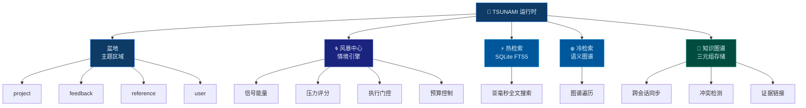

<p align="center">
  
</p>

<h1 align="center">🌊 TSUNAMI</h1>

<p align="center">
  <strong>面向 AI Agent 的海洋记忆运行时</strong>
</p>

<p align="center">
  Bun 原生 · 风暴中心情境引擎 · 热+冷检索 · 知识图谱同步
</p>

<p align="center">
  
  
  
  
  
</p>

<p align="center">
  <a href="README.md">English</a>
</p>

---

<div align="center">

## 为什么是 TSUNAMI？

</div>

大多数 AI 记忆系统是**扁平的**、**无状态的**、**上下文脆弱的**。

TSUNAMI 把记忆视为**流动的洋流** — 不是静态文本，而是**动量**。每条记忆携带能量、形成压力、链接证据，并汇入一个实时建模 Agent 认知状态的风暴中心。

> TSUNAMI 不存储文字，它建模**动量**。

---

<div align="center">

## 🌊 架构设计

</div>



---

<div align="center">

## 🧩 核心系统

</div>

<table>
<tr>
<td width="50%">

### 🌀 风暴中心

**活跃信号汇聚引擎。**

风暴中心持续评估 Agent 的上下文 — 测量信号能量、计算压力评分、检测风暴模式、发布执行门控。它是一个实时认知仪表盘，告诉 Agent *当前什么最重要*。

- 多因素压力分析
- 执行门控：`proceed`（全速）/ `guarded`（谨慎）/ `hold`（暂停）
- 置信度与就绪度评估
- 按任务分配预算

</td>
<td width="50%">

### 🌊 盆地与洋流

**按主题组织的记忆流。**

记忆随洋流变化在盆地（主题区域）之间流动。每个盆地追踪一个活跃焦点，系统自动将新记忆分类到正确的盆地/洋流对。上下文不是存储的 — 它是*流动的*。

- 6 个盆地：epicenter、surface、faultline、abyss、surge、harbor
- 24 个具名洋流，完整分类映射
- 自动文本分类
- 兼容旧版 wing/room 命名空间

</td>
</tr>

<tr>
<td width="50%">

### ⚡ 热 + 冷检索

**双通道回想引擎。**

热检索走 SQLite FTS5 全文搜索，亚毫秒级响应。冷检索遍历知识图谱，进行语义级关联发现。两条通道始终可用，按上下文加权。

- FTS5 全文搜索（亚毫秒级）
- 知识图谱 BFS 遍历
- 跨盆地隧道发现
- 所有三元组带时间有效性追踪

</td>
<td width="50%">

### 🧠 运行时图谱同步

**持久化分布式认知。**

记忆不是孤立的 — 它们构成一张图谱。每条记忆可以链接到证据、跨会话关联、并接受冲突检测。每次写入自动同步图谱。

- 跨会话记忆连续性
- 冲突检测与置信度调整
- 证据链接到文件、对话和配置
- 三元组存储带置信度、有效性和溯源

</td>
</tr>
</table>

---

<div align="center">

## ⚡ 快速上手

</div>

```bash
bun install
```

```typescript
import {
  tsunamiAdd, tsunamiSearch,
  buildTsunamiStormCenter, formatTsunamiStormCenterText,
} from './src/index.ts';

// 存储记忆
const id = await tsunamiAdd('project', 'tasks', '完成了认证模块的 API 重构', 5);

// 全文搜索 — 亚毫秒级 FTS5
const hits = await tsunamiSearch('重构', 'project', undefined, 5);

// 风暴中心 — 实时上下文分析
const storm = buildTsunamiStormCenter({ query: '继续开发工作' });
console.log(formatTsunamiStormCenterText(storm));
```

> 零外部依赖。无需启动服务器。SQLite 内置于 Bun。  
> 需要 HTTP 或 MCP 方式接入？请看下方[接口](#-接口)。

---

<div align="center">

## 🔌 接口

</div>

TSUNAMI 提供三种接口。按你的技术栈选择。

---

### 🤖 MCP 工具 — Claude Code、Cursor、Windsurf

在 `~/.claude/mcp.json` 中配置一次：

```json
{
  "mcpServers": {
    "tsunami": {
      "command": "bun",
      "args": ["run", "/path/to/TSUNAMI/server/mcp.ts"],
      "env": { "TSUNAMI_HOME": "~/.tsunami" }
    }
  }
}
```

MCP 服务自动启动。八个工具可用：

<details open>
<summary><strong>🌀 tsunami_storm</strong> — 构建风暴中心上下文</summary>

```json
{ "query": "继续 API 开发工作" }
```

返回流向、风暴模式、压力等级、执行门控、预算和优先行动指令。

</details>

<details>
<summary><strong>🌊 tsunami_add</strong> — 存储记忆</summary>

```json
{ "content": "决定用 Redis 做缓存", "wing": "decision", "energy": 4 }
```

返回唯一 `bunmem_xxx` ID。支持中文、emoji、任意 Unicode。

</details>

<details>
<summary><strong>🔍 tsunami_search</strong> — FTS5 全文搜索</summary>

```json
{ "query": "Redis 缓存", "wing": "project", "limit": 5 }
```

亚毫秒级 SQLite FTS5 搜索，支持 wing/room 过滤。

</details>

<details>
<summary><strong>📋 tsunami_recall</strong> — 上下文回想</summary>

```json
{ "wing": "project", "limit": 10 }
```

按主题拉取近期记忆，按重要性和时间排序。

</details>

<details>
<summary><strong>📜 tsunami_timeline</strong> — 时间线</summary>

```json
{ "limit": 20 }
```

按时间顺序排列所有记忆。

</details>

<details>
<summary><strong>📓 tsunami_diary</strong> — 会话日志</summary>

```json
{ "entry": "今天构建了认证模块", "agent": "claude" }
```

自动加时间戳的日记条目。

</details>

<details>
<summary><strong>📊 tsunami_status</strong> — 系统健康</summary>

```json
{}
```

记忆数量、盆地统计、后端信息。

</details>

<details>
<summary><strong>🗂️ tsunami_wings</strong> — 主题分类</summary>

```json
{}
```

所有盆地/区域及条目数量。

</details>

---

### 🌐 HTTP API — 任何语言

```bash
TSUNAMI_PORT=18904 TSUNAMI_HOME=~/.tsunami bun run server/api.ts
```

| 方法 | 端点 | 用途 |
|--------|----------|---------|
| `POST` | `/add` | 🌊 存储记忆 |
| `GET` | `/search` | 🔍 FTS5 全文搜索 |
| `GET` | `/recall` | 📋 上下文回想 |
| `GET` | `/storm` | 🌀 构建风暴中心 |
| `GET` | `/status` | 📊 系统健康 |
| `GET` | `/timeline` | 📜 时间排列 |
| `POST` | `/diary` | 📓 会话日志 |
| `GET` | `/health` | ✅ 存活检查 |

<table>
<tr><td width="33%">

**Shell**

```bash
curl -X POST localhost:18904/add \
  -H 'Content-Type: application/json' \
  -d '{"wing":"project",
       "content":"重构了认证模块",
       "energy":4}'
```

</td><td width="33%">

**Python**

```python
import requests
r = requests.post(
  'http://localhost:18904/add',
  json={'wing': 'feedback',
        'content': '用户偏好深色模式',
        'energy': 5}
)
```

</td><td width="33%">

**TypeScript**

```typescript
const r = await fetch(
  'http://localhost:18904/add', {
  method: 'POST',
  headers: {'Content-Type': 'application/json'},
  body: JSON.stringify({
    wing: 'reference',
    content: 'Bun sqlite API 文档',
    energy: 3})
});
```

</td></tr>
</table>

---

### 📦 TypeScript SDK — 编程式调用

```typescript
import {
  tsunamiAdd, tsunamiSearch, tsunamiRecall,
  tsunamiKgAdd, tsunamiKgQuery,
  buildTsunamiStormCenter, formatTsunamiStormCenterText,
  buildTsunamiExecutionGate, applyTsunamiExecutionGateToTool,
  classifyMemory,
} from './src/index.ts';

const id   = await tsunamiAdd('project', 'tasks', '完成认证模块重构', 5);
const hits = await tsunamiSearch('重构', 'project', undefined, 10);

const storm = buildTsunamiStormCenter({
  projectDir: './my-project',
  query: '继续开发工作',
});
console.log(formatTsunamiStormCenterText(storm));
```

---

<div align="center">

## 🤖 自动记忆

</div>

默认情况下 TSUNAMI 为**显式调用** — 你决定何时存储或回想。要免手动记忆，可通过 Claude Code hooks 接入生命周期。

**前提：** HTTP API 以守护进程运行（`bun run server/api.ts &` 或 PM2/launchd）。

### 会话启动 · 上下文注入

Claude 启动时自动注入风暴中心上下文：

```json
{
  "hooks": {
    "SessionStart": [{
      "matcher": "",
      "hooks": [{
        "type": "command",
        "command": "STORM=$(curl -s 'http://localhost:18904/storm' | python3 -c \"import sys,json; d=json.load(sys.stdin); t=d.get('storm',{}).get('text',''); print(t[:3000])\" 2>/dev/null); if [ -n \"$STORM\" ]; then echo \"$STORM\"; fi"
      }]
    }]
  }
}
```

### 会话结束 · 自动日记

每次会话结束后自动记录：

```json
{
  "hooks": {
    "Stop": [{
      "matcher": "",
      "hooks": [{
        "type": "command",
        "command": "curl -s -X POST http://localhost:18904/diary -H 'Content-Type: application/json' -d '{\"entry\":\"会话结束\",\"agent\":\"claude\",\"wing\":\"session\",\"importance\":3}' > /dev/null 2>&1"
      }]
    }]
  }
}
```

### 每次输入 · 决策捕获

检测到 `决定`、`合并`、`部署`、`发布`、`上线` 等关键词时自动归档到决策盆地：

```json
{
  "hooks": {
    "UserPromptSubmit": [{
      "matcher": "",
      "hooks": [{
        "type": "command",
        "command": "PROMPT=$(cat); if echo \"$PROMPT\" | grep -qiE 'decid|chose|finaliz|merge|deploy|releas|shipp|决定|选择|合并|部署|发布|上线'; then curl -s -X POST http://localhost:18904/add -H 'Content-Type: application/json' -d \"{\\\"wing\\\":\\\"decision\\\",\\\"content\\\":\\\"$(echo $PROMPT | tr '\\\"' ' ' | head -c 500)\\\",\\\"energy\\\":4}\" > /dev/null 2>&1; fi"
      }]
    }]
  }
}
```

---

<div align="center">

## ⚙️ 环境变量

</div>

| 变量 | 默认值 | 说明 |
|----------|---------|-------------|
| `TSUNAMI_HOME` | `.tsunami` | 数据存储目录 |
| `TSUNAMI_PORT` | `18904` | HTTP API 端口 |
| `TSUNAMI_STORM_THRESHOLD` | `0.7` | 风暴信号最低能量阈值 |
| `TSUNAMI_BUDGET_STEPS` | `99` | 默认执行步数预算 |

---

<div align="center">

## 📄 协议

</div>

<p align="center">
MIT © TSUNAMI Memory System
</p>
